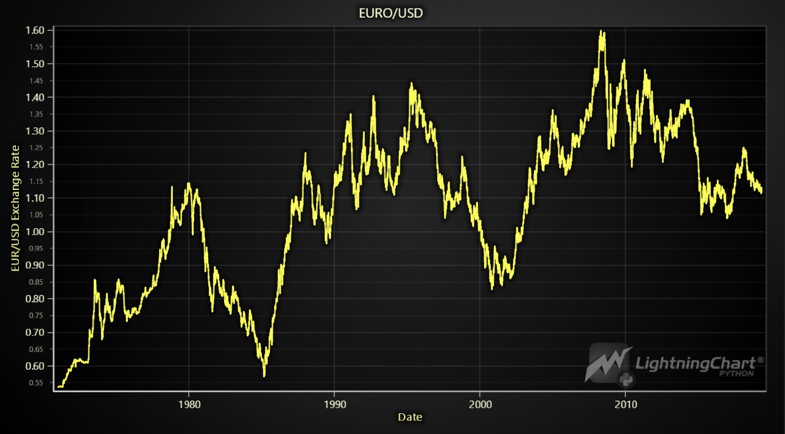
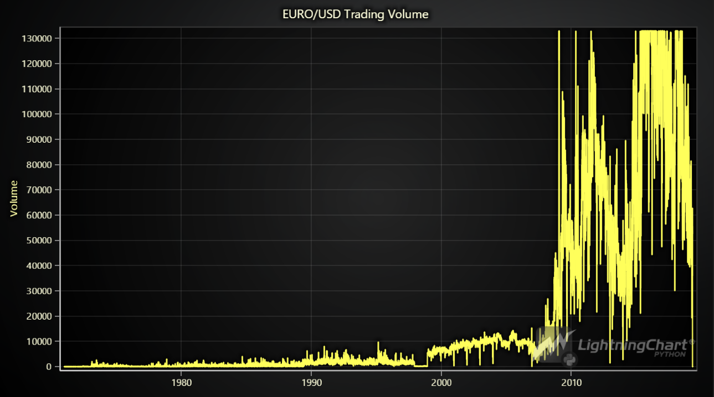
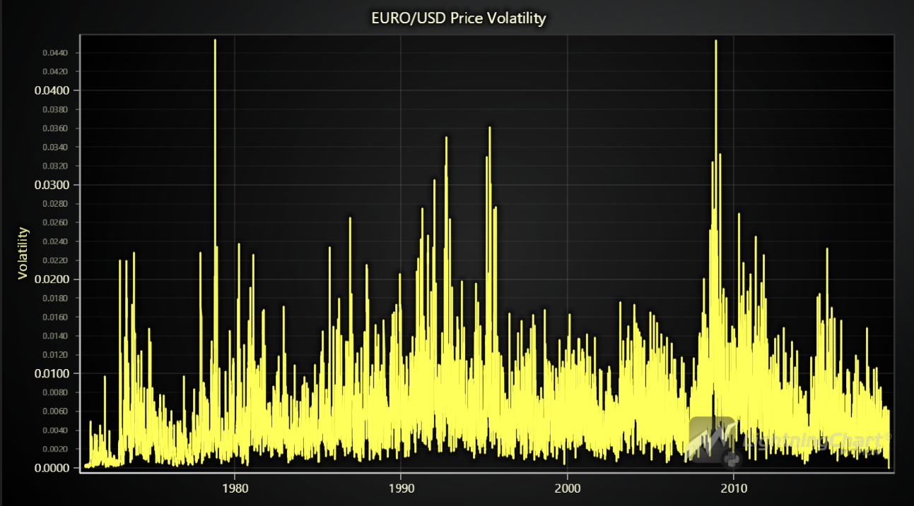
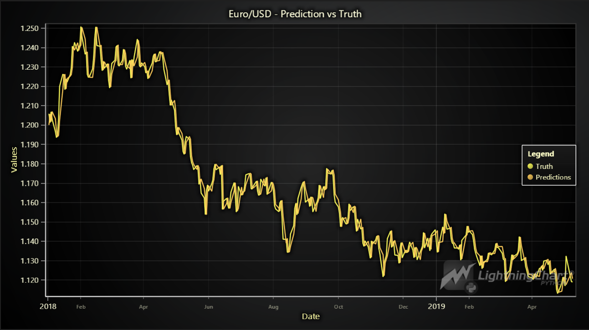
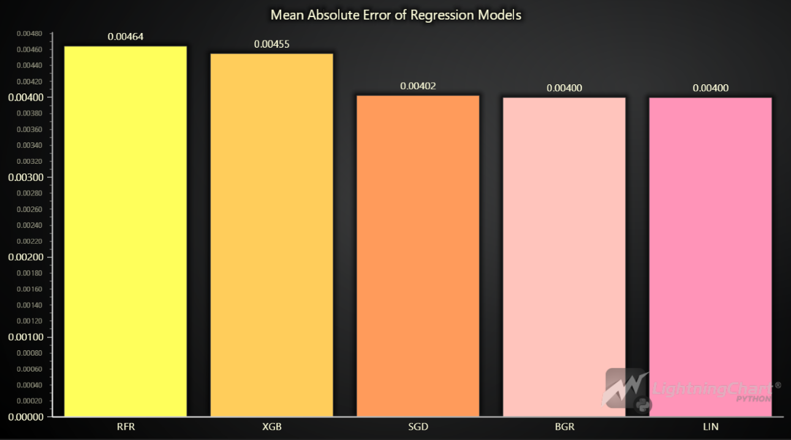
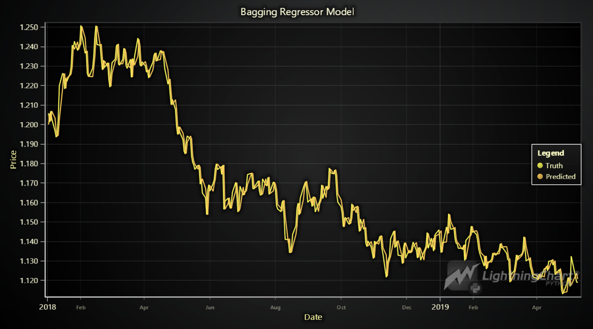
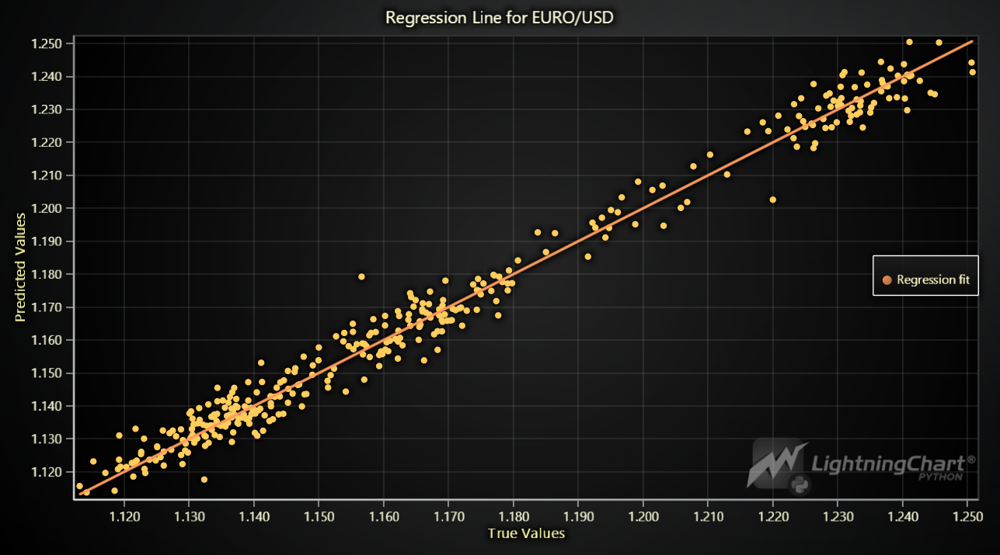
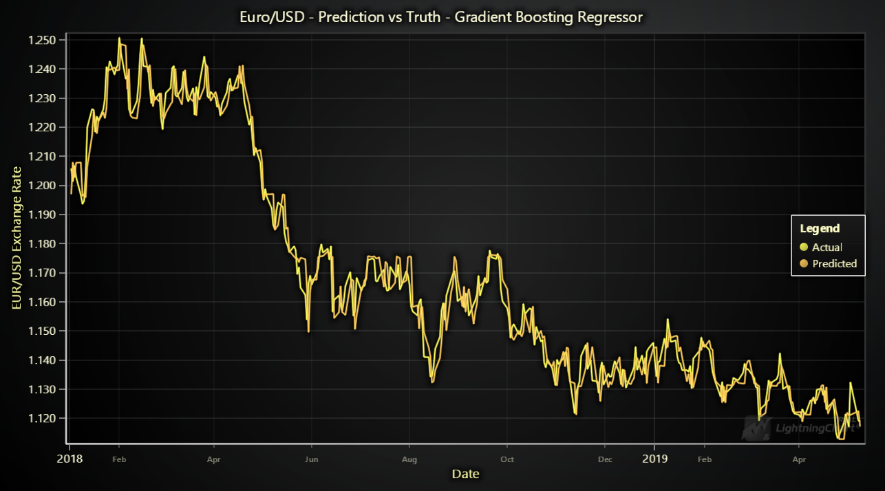

## Euro/Dollar Forex Pair Analysis with LightningChart Python

### 1. Introduction
Predicting currency exchange rates is crucial for economic stability, investment strategies, and international trade. The Euro vs. Dollar forecast using Python can provide insightful predictions for traders and economists. By leveraging machine learning techniques like Gradient Boosting Regressor (GBR), we can analyze the EUR/USD exchange rate to predict future movements and compare daily versus hourly data forecasts. This article will guide you through the process, using the powerful visualization capabilities of LightningChart Python.

#### 1.1 Economic market impact of predicting the currency exchange
Understanding the exchange rate between the Euro and the Dollar is vital for numerous stakeholders:
    • Investors need accurate forecasts to make informed decisions.
    • Businesses involved in international trade rely on exchange rate predictions to manage risk and optimize profits.
    • Governments and central banks monitor exchange rates to formulate monetary policies.

Accurate predictions of the Euro to Dollar exchange rate can lead to better financial planning and risk management. Utilizing Python for this task offers flexibility and robust data analysis capabilities.

#### 1.2 Impact of using machine learning in EUR/USD Exchange Rate Analysis
Using machine learning, including Gradient Boosting Regressor (GBR), in EUR/USD exchange rate analysis improves prediction accuracy, handles large datasets, and adapts to market changes. It automates analysis, enhances risk management, uncovers hidden patterns, and provides real-time insights. GBR boosts prediction performance by combining multiple models, making it especially effective for forex analysis.

### 2. LightningChart Python 

#### 2.1 Overview of LightningChart Python
LightningChart is a high-performance data visualization library that provides a wide range of chart types and features, ideal for visualizing complex data sets like those used in stock market sentiment analysis. Its Python version allows developers to create interactive, high-performance visualizations with ease.

#### 2.2 Features and Chart Types to be Used in the Project
LightningChart Python offers a variety of chart types, each designed to handle specific types of data visualization needs. In this project, we use the following chart types to visualize stock price prediction data:

- **XY Chart**: For visualizing data in two dimensions with series types such as Line Series, Point Line Series, and Area Series.
- **Line Series**: Ideal for displaying continuous data points connected by straight lines, useful for showing trends over time.
- **Bar Chart**: Used for visualizing categorical data as bars, making it easy to compare different categories side by side.


#### 2.3 Performance Characteristics
LightningChart handling millions of data points with ease and maintaining smooth user interactions. One of the standout aspects of LightningChart Python is its performance. The library is optimized for handling large volumes of data with minimal latency, which is crucial for financial applications where data needs to be processed and visualized in real-time to inform trading decisions.

### 3. Setting Up Python Environment

#### 3.1 Installing Python and Necessary Libraries
Install Python from the [official website](https://www.python.org/downloads/) and use pip to install necessary libraries including LightningChart Python from PyPI. To get the [documentation](https://lightningchart.com/python-charts/docs/) and the [license](https://lightningchart.com/python-charts/), please visit [LightningChart Website](https://lightningchart.com/).

```python
pip install lightningcharts random numpy pandas scikit-learn
```

```python
# Ignoring warnings
import warnings
warnings.simplefilter('ignore')

# Importing necessary modules
import sys
import pandas as pd
import numpy as np

import sklearn
from sklearn.linear_model import LinearRegression, SGDRegressor
from sklearn.svm import SVR
from sklearn.ensemble import BaggingRegressor, RandomForestRegressor, GradientBoostingRegressor
from sklearn.preprocessing import StandardScaler, MinMaxScaler
from sklearn.metrics import mean_squared_error, mean_absolute_error, r2_score
import joblib
from sklearn.model_selection import RandomizedSearchCV, GridSearchCV, train_test_split
from scipy.stats import randint

import xgboost
from xgboost import XGBRegressor, DMatrix
```

#### 3.2 Overview of Libraries Used
- **LightningChart**: Advanced data visualization.
- **NumPy**: Numerical computation.
- **Pandas**: Data manipulation and analysis.

#### 3.3 Setting Up Your Development Environment
Recommended IDEs include Jupyter Notebook, PyCharm, or Visual Studio Code.

### 4. Loading and Processing Data

#### 4.1 How to Load the Data Files
Euro/Dollar Forex data can be obtained from various sources. For this example, we’ll use a CSV file from Kaggle, the world's largest data science and machine learning community:

```python
import pandas as pd

# Load the CSV file
eu = pd.read_csv('./eu.csv', parse_dates=True, skipinitialspace=True)
```

#### 4.2 Handling and preprocessing the data
Preprocessing steps may include handling missing values, normalizing data, and feature engineering.

```python
# Strip spaces from column names
eu.columns = eu.columns.str.strip()

# Now, you can safely drop the 'date' column if it's not needed
eu.drop('date', axis='columns', inplace=True)

# Print columns to verify the correction
print(eu.columns)

eu.isna().sum()
```

#### 4.3 Validation of the Study
The validation results indicate that the Gradient Boosting Regressor (GBR) performed exceptionally well in predicting the EUR/USD exchange rate:

    • RMSE (0.0056): Low prediction error, indicating high accuracy.
    • MAE (0.0044): Small average error between predicted and actual values, confirming precise predictions.
    • R² (0.9793): High explanatory power, with the model accounting for almost 98% of the variance in the data.

Overall, these metrics demonstrate that the GBR model is highly effective and reliable for forecasting the EUR/USD exchange rate.

### 5. Visualizing Data with LightningChart

#### 5.1 Introduction to LightningChart for Python
LightningChart Python allows for the creation of highly interactive and customizable charts. Here are some of the LC charts below:










#### 5.2 Creating the charts
To visualize the data, you can create various charts using LightningChart Python:

```python
import lightningchart as lc
import random

# Initialize LightningChart and set the license key
lc.set_license('my-license-key')

# Create a BarChart using LightningChart
chart = lc.ChartXY(title= ' EURO/USD')
```

#### 5.3 Customizing visualizations
LightningChart offers extensive customization options. You can change the theme and colors, add markers, hide or sort some features or integrate real-time data updates to enhance the visualization:

```python
# Initialize the chart
chart = lc.ChartXY(
    theme=lc.Themes.Dark,
    title='EURO/USD'
)

# Get the x and y values from your DataFrame
x_values = eu['timestamp_ms'].tolist()
y_values = eu['close'].tolist()

# Add the time series data to the chart
series = chart.add_line_series().append_samples(
    x_values=x_values,
    y_values=y_values
)
series.set_line_thickness(2)  # Adjust the line thickness as needed

# Open the chart
chart.open()
```

### 6. Conclusion

#### 6.1 Recap of creating the application
In this article, we explored the Euro/Dollar forecast using Python and LightningChart. We set up the Python environment, loaded and processed data, and visualized it using LightningChart.

#### 6.2 Why is it useful?
Using LightningChart Python for visualizing forex data provides:
    • Real-time data processing capabilities.
    • High-performance visualization for large datasets.
    • Customizable charts that enhance data interpretation.

#### 6.3 Benefits of using LightningChart Python for visualizing data
LightningChart Python is a powerful tool for financial data visualization due to its performance, customization options, and ease of use. It is particularly useful for creating interactive and real-time visualizations that can aid in making informed trading decisions.


